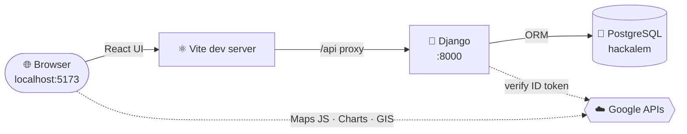

<div align="center">

```
   ██████╗ ██████╗ ███████╗██████╗ ███████╗
  ██╔═══██╗██╔══██╗██╔════╝██╔══██╗██╔════╝
  ██║   ██║██████╔╝█████╗  ██████╔╝███████╗
  ██║▄▄ ██║██╔══██╗██╔══╝  ██╔══██╗╚════██║
  ╚██████╔╝██████╔╝███████╗██║  ██║███████║
   ╚══▀▀═╝ ╚═════╝ ╚══════╝╚═╝  ╚═╝╚══════╝
```

### `// HACKALEM · TEAM QBERS · SYSTEM ONLINE`


<br/>

**One command. Full stack. Localhost in minutes.**

</div>

---

## ⚡ `01` — LAUNCH SEQUENCE

> [!IMPORTANT]
> **Before you start:** ask a teammate for the project's **`.env`** file and drop it in the repo root.
> It holds our API keys and is intentionally **not** in Git. No `.env`? `setup.sh` will create one and ask you to paste the Google keys.

```bash
git clone https://github.com/BAITC-Hacks/hack-b53220ee-qbers.git
```

```bash
cd hack-b53220ee-qbers
```

```bash
./setup.sh
```

That's it. The script installs everything, builds the database, and your browser opens **[`http://localhost:5173`](http://localhost:5173)** automatically.

<details>
<summary><b>🪟 &nbsp;Windows users — click here</b></summary>

<br/>

1. Install **[Git for Windows](https://git-scm.com/download/win)** (includes *Git Bash*).
2. Make sure **winget** exists — it ships with Windows 10/11 as *App Installer* in the Microsoft Store.
3. Open **Git Bash**, `cd` into the repo, and run `./setup.sh`.
4. If it says a tool is *not found* right after installing, close Git Bash, reopen it, and run `./setup.sh` again (Windows needs a fresh terminal to pick up the new PATH).

</details>

<details>
<summary><b>🐧 &nbsp;Linux users — click here</b></summary>

<br/>

Debian/Ubuntu (apt) is automated. The script uses `sudo` to install packages and start PostgreSQL.

</details>

### ↻ Every time after that

```bash
./run.sh
```

Press <kbd>Ctrl</kbd> + <kbd>C</kbd> to shut down both servers.

---

## 🛰️ `02` — WHAT `setup.sh` DOES

```
┌─────────────────────────────────────────────────────────────────────────┐
│  [1] DETECT      macOS  ·  Windows (Git Bash)  ·  Linux (apt)           │
│  [2] PKG MGR     installs Homebrew  ─or─  uses winget  ─or─  apt        │
│  [3] RUNTIME     Python 3  ·  Node.js  ·  PostgreSQL 16                 │
│  [4] DATABASE    starts Postgres, creates role + db  "hackalem"         │
│  [5] SECRETS     .env from template, generates Django SECRET_KEY        │
│  [6] BACKEND     .venv  →  pip install Django etc.  →  migrate + seed   │
│  [7] FRONTEND    npm install  (React + Vite)                            │
│  [8] IGNITION    ./run.sh  →  Django :8000  +  React :5173  →  browser  │
└─────────────────────────────────────────────────────────────────────────┘
```

It's **safe to re-run** — every step skips what's already installed.

---

## 🧬 `03` — ARCHITECTURE



| Layer | Tech | Job |
|:--|:--|:--|
| <samp>UI</samp> | **React 19 + Vite** | Landing page, components, Google widgets |
| <samp>API</samp> | **Django** | Forms, auth, site actions (`/api/*`, `/admin`) |
| <samp>DATA</samp> | **PostgreSQL 16** | Waitlist sign-ups, chart metrics, map pins, users |
| <samp>CLOUD</samp> | **Google** | Maps, Charts, Sign-In with Google, Analytics |
| <samp>CLOUD</samp> | **AWS** | Hosting / services (coming soon) |
| <samp>STYLE</samp> | **Font Awesome · Rubik · EB Garamond** | Icons and typography |

---

## 🗂️ `04` — FILE MAP

```
hackalem/
├── setup.sh               ⟶  one-time installer + launcher
├── run.sh                 ⟶  start Django + React, open browser
├── .env.example           ⟶  template of every variable (committed)
├── .env                   ⟶  real secrets (gitignored — get from a teammate)
├── backend/               ⟶  Django project
│   ├── config/            ·  settings.py reads everything from .env
│   └── core/              ·  models, forms, API views, seed migrations
└── frontend/              ⟶  React (Vite)
    ├── index.html         ·  loads the Font Awesome kit
    └── src/
        ├── lib/env.js     ·  the only place the UI reads .env
        └── components/    ·  MapCard · ChartCard · WaitlistForm · SignIn · StatusGrid
```

---

## 🔐 `05` — ENVIRONMENT VARIABLES

All config lives in **one** root-level `.env`, shared by Django and React.
Only variables prefixed **`VITE_`** reach the browser — secrets never do.

| Variable | Used by | Purpose |
|:--|:--|:--|
| `GOOGLE_API_KEY` | React | Google Maps + Charts |
| `GOOGLE_OAUTH_CLIENT_ID` | React + Django | "Sign in with Google" |
| `GOOGLE_OAUTH_CLIENT_SECRET` | Django only | OAuth server-side flows |
| `GA_MEASUREMENT_ID` | React | Google Analytics 4 (`G-XXXXXXX`, optional) |
| `POSTGRES_*` | Django | Database connection (defaults work locally) |
| `DJANGO_SECRET_KEY` | Django | Auto-generated by `setup.sh` |
| `AWS_*` | Django | AWS console info + future IAM access keys |
| `VITE_FONTAWESOME_KIT_URL` | React | Font Awesome icon kit |
| `VITE_FONT_SANS` / `VITE_FONT_SERIF` | React | Google Fonts — `Rubik` / `EB Garamond` |

> [!CAUTION]
> **Never commit `.env`.** It's in `.gitignore` — keep it that way. Share it over DM / a password manager, not in the repo or a public channel.

---

## 🧪 `06` — VERIFY IT WORKS

The landing page has live status tiles. All four should glow green:

| Tile | Proves |
|:--|:--|
| <i>React</i> | the frontend rendered |
| <i>Django</i> | the API is reachable through the Vite proxy |
| <i>PostgreSQL</i> | Django queried the database |
| <i>Google keys</i> | `.env` was loaded |

Then scroll down: the **map** pins and **chart** bars come from Postgres, and the **waitlist form** saves a row through a Django form. View rows at **[`/admin`](http://localhost:5173/admin/)** after creating an admin user:

```bash
source .venv/bin/activate && python backend/manage.py createsuperuser
```

---

## 🛠️ `07` — TROUBLESHOOTING

<details>
<summary><b>Port 5173 or 8000 already in use</b></summary>

Another copy is probably running. Stop it with <kbd>Ctrl</kbd>+<kbd>C</kbd>, or find it:

```bash
lsof -i :5173 -i :8000
```
</details>

<details>
<summary><b>PostgreSQL tile is red</b></summary>

```bash
brew services restart postgresql@16
```

Then re-run `./setup.sh` — it recreates the role and database if missing.
</details>

<details>
<summary><b>Map says "For development purposes only" or is grey</b></summary>

The Google API key needs **Maps JavaScript API** enabled and billing turned on in Google Cloud Console, and must allow `http://localhost:5173/*` as a referrer.
</details>

<details>
<summary><b>"Sign in with Google" button missing or errors</b></summary>

In Google Cloud Console → **Credentials** → your OAuth client, add `http://localhost:5173` and `http://localhost` to **Authorized JavaScript origins**.
</details>

<details>
<summary><b>Django won't start</b></summary>

Check the log:

```bash
tail -50 logs/django.log
```
</details>

---

<div align="center">

<sub>`▓▓▓▓▓▓▓▓▓▓▓▓▓▓▓▓▓▓▓▓▓▓▓▓▓▓▓▓▓▓▓▓▓▓▓▓▓▓▓▓▓▓▓▓▓▓▓▓▓▓▓▓▓▓▓▓▓▓▓▓`</sub>

**QBERS** · built at HackAlem · `EOF`

</div>
