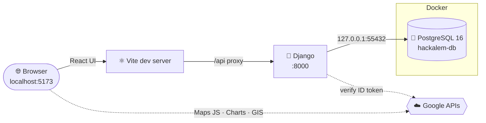

<div align="center">

```
   ██████╗ ██████╗ ███████╗██████╗ ███████╗
  ██╔═══██╗██╔══██╗██╔════╝██╔══██╗██╔════╝
  ██║   ██║██████╔╝█████╗  ██████╔╝███████╗
  ██║▄▄ ██║██╔══██╗██╔══╝  ██╔══██╗╚════██║
  ╚██████╔╝██████╔╝███████╗██║  ██║███████║
   ╚══▀▀═╝ ╚═════╝ ╚══════╝╚═╝  ╚═╝╚══════╝
```

### `// HACKALEM · TEAM QBERS · SYSTEM ONLINE`


<br/>

**One command. Full stack. Same database on every machine.**

</div>

---

## ⚡ `01` — LAUNCH SEQUENCE

You don't need anything installed first — setup installs **Python, Node.js and Docker** for you, then starts our **PostgreSQL database inside Docker** with the same tables, data, username and password as everyone else on the team.

> [!NOTE]
> **No keys to hunt down.** Our `.env` (API keys, database login) is committed to this **private** repo, so it's already in your clone.

There are only **two steps**: run setup **once**, then use **`npm start`** every time after.

<table>
<tr>
<th width="50%">🍎 &nbsp;macOS &nbsp;·&nbsp; 🐧 Linux</th>
<th width="50%">🪟 &nbsp;Windows (Command Prompt)</th>
</tr>
<tr>
<td valign="top">

Open **Terminal**, then run:

```bash
git clone https://github.com/BAITC-Hacks/hack-b53220ee-qbers.git
cd hack-b53220ee-qbers
./setup.sh
```

</td>
<td valign="top">

Press <kbd>Win</kbd>, type **cmd**, press <kbd>Enter</kbd>, then run:

```bat
git clone https://github.com/BAITC-Hacks/hack-b53220ee-qbers.git
cd hack-b53220ee-qbers
setup.cmd
```

</td>
</tr>
<tr>
<td valign="top">

<sub>Installs Homebrew (or uses apt) → Python, Node, **Docker Desktop**.<br/>You may be asked for your computer password.</sub>

</td>
<td valign="top">

<sub>Uses winget → Python, Node, **Docker Desktop**.<br/>Click **Yes** on any Windows permission pop-ups.</sub>

</td>
</tr>
</table>

### 🐳 During setup you'll be asked

| Prompt | What to do |
|:--|:--|
| **Docker Desktop window opens** (first install only) | Accept the terms. Skip the sign-in screen if you like. Leave it running. On Windows it may ask to install WSL or restart — do it, then run setup again. |
| `Log in to Docker Hub? [y/N]` | Optional. Type **y** and enter your Docker Hub username + password (or access token) to avoid download limits — or press <kbd>Enter</kbd> to skip. Your password goes straight to Docker; the script never stores it. |
| Computer password (macOS/Linux) | Needed to install Homebrew / apt packages. |

When setup finishes, your browser opens **[`http://localhost:5173`](http://localhost:5173)** on its own. 🚀

### ↻ Every time after that

Make sure **Docker Desktop is open** (the app starts it for you if it can), then from the project folder in any terminal — Terminal, cmd, or PowerShell:

```bash
npm start
```

<sub>Using pnpm? `pnpm start` works the same way.</sub>

Press <kbd>Ctrl</kbd> + <kbd>C</kbd> to stop the web servers. The database container keeps running quietly in Docker, so your data is still there next time.

### ⌘ Command cheat-sheet

| I want to… | npm | pnpm | macOS / Linux | Windows cmd |
|:--|:--|:--|:--|:--|
| **Install everything** (first time) | `npm run setup` * | `pnpm run setup` * | `./setup.sh` | `setup.cmd` |
| **Start the app** | `npm start` | `pnpm start` | `./run.sh` | `npm start` |
| **Stop the app** | <kbd>Ctrl</kbd>+<kbd>C</kbd> | <kbd>Ctrl</kbd>+<kbd>C</kbd> | <kbd>Ctrl</kbd>+<kbd>C</kbd> | <kbd>Ctrl</kbd>+<kbd>C</kbd> |
| **Share my data with the team** | `npm run db:snapshot` | `pnpm run db:snapshot` | ← same | ← same |
| **Reload the team's data** (wipes mine) | `npm run db:reset` | `pnpm run db:reset` | ← same | ← same |
| **Open a SQL prompt** | `npm run db:shell` | `pnpm run db:shell` | ← same | ← same |

<sub>\* Only if Node.js is already installed. On a brand-new computer, use `./setup.sh` or `setup.cmd`, which install Node for you. It's `pnpm run setup`, not `pnpm setup` — that one is a built-in pnpm command.</sub>

<details>
<summary><b>🪟 &nbsp;Windows notes</b></summary>

<br/>

- **Don't have Git?** Install it with `winget install Git.Git`, or download the ZIP from GitHub (green **Code** button → *Download ZIP*), unzip it, and double-click **`setup.cmd`**.
- **No `winget`?** It ships with Windows 10/11 as *App Installer* from the Microsoft Store. Update it, then run `setup.cmd` again.
- **"… not found" right after installing:** Windows only refreshes PATH in new windows. Close cmd, open a new one, `cd` back into the folder, and run `setup.cmd` again. It picks up where it left off.
- **Docker Desktop needs WSL 2.** If it asks to install WSL or restart, do it, reopen Docker Desktop, wait for *Engine running*, then run `setup.cmd` again.
- **Prefer Git Bash?** `./setup.sh` works there too.

</details>

<details>
<summary><b>🐧 &nbsp;Linux notes</b></summary>

<br/>

Debian/Ubuntu (apt) is automated. Docker Engine is installed with Docker's official script and you're added to the `docker` group — until you log out and back in, the scripts use `sudo docker` automatically.

</details>

---

## 🛰️ `02` — WHAT SETUP DOES

```
┌──────────────────────────────────────────────────────────────────────────┐
│  [1] CONFIG      reads .env — DB name, user, password, port, API keys    │
│  [2] PKG MGR     installs Homebrew  ─or─  uses winget  ─or─  apt         │
│  [3] RUNTIME     Python 3  ·  Node.js  ·  Docker                         │
│  [4] DOCKER      starts the engine, optional Docker Hub login            │
│  [5] DATABASE    docker compose up db  →  Postgres 16 on :55432          │
│                  first run loads db/init/01-snapshot.sql (team data)     │
│  [6] BACKEND     .venv  →  pip install Django etc.  →  migrate           │
│  [7] FRONTEND    npm install  (React + Vite)                             │
│  [8] IGNITION    npm start  →  Django :8000  +  React :5173  →  browser  │
└──────────────────────────────────────────────────────────────────────────┘
```

It's **safe to re-run** — every step skips what's already installed.

---

## 🧬 `03` — ARCHITECTURE



| Layer | Tech | Job |
|:--|:--|:--|
| <samp>UI</samp> | **React 19 + Vite** | Landing page, components, Google widgets |
| <samp>API</samp> | **Django** | Forms, auth, site actions (`/api/*`, `/admin`) |
| <samp>DATA</samp> | **PostgreSQL 16 in Docker** | Waitlist sign-ups, chart metrics, map pins, users |
| <samp>CLOUD</samp> | **Google** | Maps, Charts, Sign-In with Google, Analytics |
| <samp>CLOUD</samp> | **AWS** | Hosting / services (coming soon) |
| <samp>STYLE</samp> | **Font Awesome · Rubik · EB Garamond** | Icons and typography |

---

## 🐘 `04` — THE TEAM DATABASE

Everyone runs the **same** Postgres, defined once in [`docker-compose.yml`](docker-compose.yml) and configured from `.env`:

| Setting | Value (from `.env`) |
|:--|:--|
| Host | `127.0.0.1` |
| Port | `55432` <sub>(unusual on purpose — won't clash with any Postgres you already have)</sub> |
| Database | `hackalem` |
| User / password | `hackalem` / `hackalem` |
| Container / volume | `hackalem-db` / `hackalem-pgdata` |

Connect with any SQL tool (TablePlus, DBeaver, pgAdmin, DataGrip) using those values, or run `npm run db:shell`.

**How the data stays in sync:**

1. The first time your container starts with an empty volume, it loads **`db/init/01-snapshot.sql`** — so you get exactly the tables and rows in the repo.
2. Changed data you want everyone to have? Run **`npm run db:snapshot`**, commit `db/init/01-snapshot.sql`, and push.
3. Teammates pull, then run **`npm run db:reset`** to replace their local data with the new snapshot.
4. Schema changes still go through Django: `python backend/manage.py makemigrations` → commit → teammates' `npm start` runs `migrate` automatically.

> [!WARNING]
> `npm run db:reset` deletes your local database volume. Snapshot first if you have data you care about.

---

## 🗂️ `05` — FILE MAP

```
hackalem/
├── .env                   ⟶  ALL config: API keys, DB login, ports (committed — private repo)
├── docker-compose.yml     ⟶  PostgreSQL container, reads .env
├── db/init/               ⟶  01-snapshot.sql — team data loaded on first start
├── package.json           ⟶  npm start · npm run setup · npm run db:*  (pnpm works too)
├── setup.sh               ⟶  one-time installer — macOS / Linux / Git Bash
├── setup.cmd · setup.ps1  ⟶  one-time installer — Windows Command Prompt
├── run.sh                 ⟶  shortcut for `npm start`
├── scripts/
│   ├── start.js           ·  Docker DB → migrate → Django → Vite → browser
│   ├── db.js              ·  snapshot / reset / shell
│   └── lib/               ·  .env reader + Docker helpers
├── backend/               ⟶  Django project
│   ├── config/            ·  settings.py reads everything from .env
│   └── core/              ·  models, forms, API views, migrations
└── frontend/              ⟶  React (Vite)
    ├── index.html         ·  loads the Font Awesome kit from .env
    └── src/
        ├── lib/env.js     ·  the only place the UI reads .env
        └── components/    ·  MapCard · ChartCard · WaitlistForm · SignIn · StatusGrid
```

---

## 🔐 `06` — ENVIRONMENT VARIABLES

All config lives in **one** root-level [`.env`](.env). Django, React, Docker Compose and the setup scripts all read it — change a value there and everything follows.
Only variables prefixed **`VITE_`** reach the browser.

| Variable | Used by | Purpose |
|:--|:--|:--|
| `POSTGRES_DB` · `POSTGRES_USER` · `POSTGRES_PASSWORD` | Docker + Django | Database name and login |
| `POSTGRES_HOST` · `POSTGRES_PORT` | Docker + Django | Where Postgres listens (`127.0.0.1:55432`) |
| `POSTGRES_VERSION` | Docker | Postgres image tag (`16`) |
| `GOOGLE_API_KEY` | React | Google Maps + Charts |
| `GOOGLE_OAUTH_CLIENT_ID` | React + Django | "Sign in with Google" |
| `GOOGLE_OAUTH_CLIENT_SECRET` | Django only | OAuth server-side flows |
| `GA_MEASUREMENT_ID` | React | Google Analytics 4 (`G-XXXXXXX`, optional) |
| `DJANGO_SECRET_KEY` · `DJANGO_DEBUG` | Django | Framework settings |
| `AWS_*` | Django | AWS console details + future IAM access keys |
| `VITE_FONTAWESOME_KIT_URL` | React | Font Awesome icon kit |
| `VITE_FONT_SANS` / `VITE_FONT_SERIF` | React | Google Fonts — `Rubik` / `EB Garamond` |

Want a personal override (say, a different port) without changing the team file? Export it in your shell before `npm start` — real environment variables win over `.env`.

> [!CAUTION]
> **This repo must stay private.** `.env` contains live Google and AWS credentials. Never make the repo public, fork it publicly, or paste `.env` anywhere outside the team.

---

## 🧪 `07` — VERIFY IT WORKS

The landing page has live status tiles. All four should glow green:

| Tile | Proves |
|:--|:--|
| <i>React</i> | the frontend rendered |
| <i>Django</i> | the API is reachable through the Vite proxy |
| <i>PostgreSQL</i> | Django queried the Docker database (shows `PostgreSQL 16… (Debian…)`) |
| <i>Google keys</i> | `.env` was loaded |

Then scroll down: the **map** pins and **chart** bars come from Postgres tables, and the **waitlist form** saves a row through a Django form. View rows at **[`/admin`](http://localhost:5173/admin/)** after creating an admin user:

```bash
.venv/bin/python backend/manage.py createsuperuser
```

```bat
.venv\Scripts\python backend\manage.py createsuperuser
```

<sub>First line: macOS / Linux. Second line: Windows cmd.</sub>

---

## 🛠️ `08` — TROUBLESHOOTING

<details>
<summary><b>"Docker did not start" / PostgreSQL tile is red</b></summary>

Open **Docker Desktop** and wait until it shows *Engine running*, then `npm start` again. Still stuck? See what the database says:

```bash
docker compose logs db
```
</details>

<details>
<summary><b>Port 55432 already in use</b></summary>

Something else took the database port. Pick another number, e.g. `POSTGRES_PORT=55433`, in `.env`, then `npm start` (the container is recreated on the new port).
</details>

<details>
<summary><b>Port 5173 or 8000 already in use</b></summary>

Another copy is probably running. Stop it with <kbd>Ctrl</kbd>+<kbd>C</kbd>, or find it:

```bash
lsof -i :5173 -i :8000
```

```bat
netstat -ano | findstr :5173
```

<sub>Django moves to the next free port on its own if 8000 is taken; only 5173 must be free.</sub>
</details>

<details>
<summary><b>My data doesn't match the team's</b></summary>

The snapshot only loads into an **empty** volume. To throw away your local data and reload the snapshot from the repo:

```bash
npm run db:reset
```
</details>

<details>
<summary><b>Map shows "Sorry! Something went wrong" (<code>ApiNotActivatedMapError</code>)</b></summary>

In Google Cloud Console (the project that owns `GOOGLE_API_KEY`) go to **APIs & Services → Library**, enable **Maps JavaScript API**, and make sure billing is on. If the key has referrer restrictions, allow `http://localhost:5173/*`. Reload the page. No restart needed.
</details>

<details>
<summary><b>"Sign in with Google" button missing or errors</b></summary>

In Google Cloud Console → **Credentials** → your OAuth client, add `http://localhost:5173` and `http://localhost` to **Authorized JavaScript origins**.
</details>

<details>
<summary><b>Django won't start</b></summary>

Check the log:

```bash
tail -50 logs/django.log
```
</details>

---

<div align="center">

<sub>`▓▓▓▓▓▓▓▓▓▓▓▓▓▓▓▓▓▓▓▓▓▓▓▓▓▓▓▓▓▓▓▓▓▓▓▓▓▓▓▓▓▓▓▓▓▓▓▓▓▓▓▓▓▓▓▓▓▓▓▓`</sub>

**QBERS** · built at HackAlem · `EOF`

</div>
